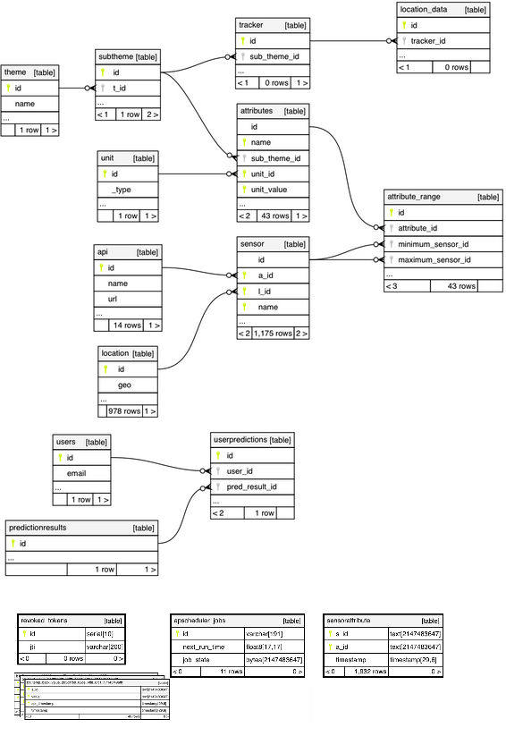

# Backend Architecture

In this section the core backend structure of SharingCities Dashboard is described. This include the database and backend server.

## Database structure 
At the very core of backend implementation of SharingCities Dashboard there is a Postgres/Postgis database holding the metadata related to the endpoint APIs the sensors and their attributes, the sourced data as well as dashboard related housekeeping data. 



A functionality description for each table is given below:

#### layouts This table stores the position and dimensions of each widget. It also contains a flag indicating weather the widget is static (on off visualisation) or dynamic (updated whenever new data are imported).

####  widgets This table stores the widgets specifications for each user and each layout. It shares a relationship with ``` layouts ``` table.

#### users This table stores the credentials for each dashboard user.

#### predictionresults This table stores the forecasting specifications and results for each user's forecasting job.

#### userpredictions This table stores the association between users and prediction ids. Prediction ids are generated every time a user requests a forecast.

#### theme Table storing the general theme for the data source (e.g. Environment).

#### subtheme Table storing a more specific subset of theme (e.g. Air Quality).

#### unit Table storing the units of measurement for each attribute.

#### tracke Table storing moving sensor metadata.

#### location_data Table storing moving sensor data.

#### attributes Table storing all attributes, associated metadata and reference data value tables using unique identifiers. 

#### api Table storing API endopoints and specifications.

#### location Table storing sensor locations.

#### sensor Table storing sensor metadata using unique identifiers.

#### attribute_range Table storing range of imported value range for each attribute.

In addition, the many-to-many relationship between sensors and attributes is stored in a separate table *sensorattribute*. Individual value tables for each attribute are stored in the database as separate tables and are referenced using the ``` table_name ``` column in **attributes** table. The uniqueness of each table is guaranteed by a combination of name and unique identifier. Each data table has the following columns:

- **s_id** 
    The ID of a particular sensor.

- **value** 
    The sensor value.

- **api_timestamp**
    The timestamp reported by the sensor. This could correspond to the time the sensor was queried or the last time the sensor reported a change in value.

- **timestamp** 
    The time the value was imported in the database.

## Backend structure 


