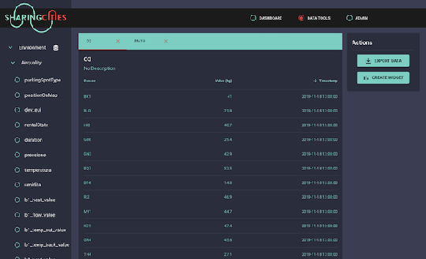

# Frontend 

SharingCities Dashboard frontend was build using the React/Redux framework. The plotting capabilities were based on [Vega](https://vega.github.io/) data visualisation library. 

The main components of the Frontend are:

* Dashboard
* Data Tools
* Admin

## Dashboard
Provides the canvas where all plotting, forecasting and alert widgets are located. The dashboard layout is user specific and referenced whenever a new user session starts. 

## Data Tools
The data tools page allows viewing of the attribute tables in the database as well as providing the following actions:

* Exporting the data values
Allows exporting of selected attribute in a CSV, JSON or GeoJson format.

* Creating widgets
Allows the creation of plot, map, forecast and alert widgets.

## Admin
Provides admin tools such as adding/deleting users. It also provides access to the importer health logs.

