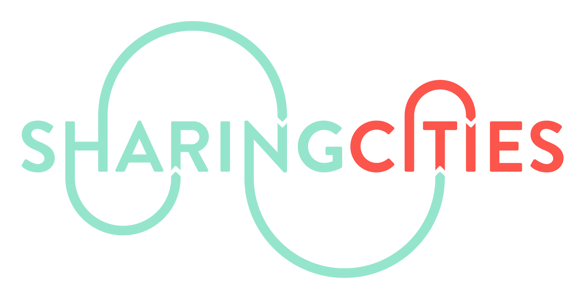

Analytics:

Frontend: 

# Sharing Cities Dashboard

## Introduction
### What is sharing cities?
The Sharing Cities programme seeks to create a better, common approach to making smart cities a reality. By fostering international collaboration between industry and cities, the project seeks to develop affordable, integrated, commercial-scale smart city solutions with a high market potential. For more information on the project click [here](https://drive.google.com/open?id=1ntDUl-UkOadJ6ov6ZzLeyOfllBFpRhW1).

### What is this tool?
This tool, provides an interface to city managers for visualising and monitoring the performance of smart city measures such as those relating to housing retrofit, integrated energy management, shared eMobility and smart lampposts. Different combinations of these 'measures' have been deployed in Greenwich, Lisbon and Milan and so this dashboard caters for each location specifically. 

To supply data to the dashboard, each city is hosting an Urban Sharing Platform (USP), which makes data from the Sharing Cities smart city measures available through APIs. In some cases, the dashboards also integrate information from other locally relevant APIs such as weather. 

### What is our vision?
Users of this dashboard will have expertise from a broad range of domains. This includes city managers, heads of service in energy, transport and the environment and potentially even the public. As a result, when investigating data from the measures, the needs of each individual are very different meaning that we cannot custom-build a tool for all needs. 

To circumvent this challenge, we have developed a tool that enables users to create interactive visualisations tailored to their needs. The users will be able to:

- Explore the data available to them through the USP in their city
- Perform forecasting on data from specific sensors or specific time-series
- Create visualisations that they want on their dashboard

## Delpoyment 

## Modules

### Back end
### Analytics
### Front end

## Quick-start

