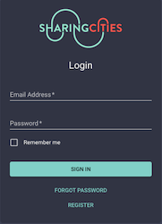
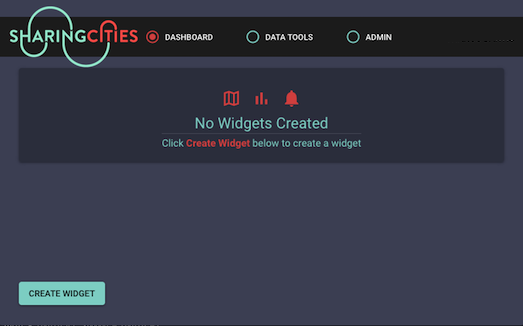

Analytics: [](https://app.wercker.com/project/byKey/350323c0db166acb5049b26ec2330f42)  Frontend: [](https://circleci.com/gh/FutureCitiesCatapult/SharingCitiesDashboard/tree/master)


# Sharing Cities Dashboard


## Introduction
### What is sharing cities?
Sharing Cities, the European Commission funded Horizon 2020 project, seeks to create a better, common approach to making smart cities a reality. By fostering international collaboration between industry and cities, the project seeks to develop affordable, integrated, commercial-scale smart city solutions with a high market potential. For more information on the project click [here](http://www.sharingcities.eu/).

### What is this tool?
This tool, provides an interface to city managers for visualising and monitoring the performance of smart city measures such as those relating to housing retrofit, integrated energy management, shared eMobility and smart lampposts. Different combinations of these 'measures' have been deployed in Greenwich, Lisbon and Milan and so this dashboard caters for each location specifically. 

To supply data to the dashboard, each city is hosting an Urban Sharing Platform (USP), which makes data from the Sharing Cities smart city measures available through APIs. In some cases, the dashboards also integrate information from other locally relevant APIs such as weather. 

### What is our vision?
Users of this dashboard will have expertise from a broad range of domains. This includes city managers, heads of service in energy, transport and the environment and potentially even the public. As a result, when investigating data from the measures, the needs of each individual are very different meaning that we cannot custom-build a tool for all needs. 

To circumvent this challenge, we have developed a tool that enables users to create interactive visualisations tailored to their needs. The users will be able to:

- Explore the data available to them through the USP in their city
- Perform forecasting on data from specific sensors or specific time-series
- Create visualisations that they want on their dashboard
- Create thresholds on specific attributes that can trigger 'alerts' in the dashboard

This repo holds the code, deployment configuration and instructions on how to use the SharingCities dashboard. The implementation of the dashboard consists of three parts:

- ***[Importers](/Documentation/importers.md)***
    * Importers are used to source open or propriety data from different APIs and providers. Examples incluse data related to air quality, traffic counts, parking spots etc.
- ***[Backend architecture](/Documentation/backend_architecture.md)***
    * A [Flask](https://flask.palletsprojects.com/en/1.1.x/) based backend server and database structure.
- ***[Frontend](/Documentation/frontend.md)***
    * A frontend implementation based on [React](https://reactjs.org/)


## Table of Contents:
- [Requirements](#requirements)
- [Installing](#installing)
- [Quick Start](#quick-start)


## Requirements
SharingCities Dashboard has the following requirements:

* [Node](https://nodejs.org/en/)
* [Python](https://www.python.org/)
* [Redis](https://redis.io/) (as a message broker)
* [PostgreSQL](https://www.postgresql.org/)
* [PostGIS](http://postgis.net/)
* [Git](https://git-scm.com/download/)


## Installing
This will specify the installation steps needed to get SharingCities Dashboard up and running on a local machine. For production deployment refer to [deployment]().

**All commands are Ubuntu specific, but should be easily adaptable to whichever platform you are using (MacOS/Windows/Linux).**

### Step 1: Clone the repository from Github
```
$ cd && git clone https://github.com/FutureCitiesCatapult/SharingCitiesDashboard
```

### Step 2: Install Postgres Database
The Postgres DB needs to be installed and initialised.
There are two ways to do this, using an Ubuntu specific script or running the commands manually:
#### Option 1. Run the setub_db script
```
$ ~/SharingCitiesDashboard/Analytics/setup_db.sh
```
#### You’ll be prompted for the SuperUser credentials
```
Fullname:
Email:
Password:
```
#### Option 2. Run the commands manually:
Check if postgres is installed:

```
$ which psql
```

If nothing is returned, install postgres:

```
$ sudo apt update
$ sudo apt install postgresql postgresql-contrib
$ sudo apt-get install postgis
```

Create SharingCities DB user

```
$ sudo -u postgres psql -c "CREATE USER sharingcities WITH PASSWORD 'sharingcities'"
```

Create analytics DB

```
$ sudo -u postgres psql -c "CREATE DATABASE analytics"
```

Grant privileges to SharingCities user

```
$ sudo -u postgres psql -c "GRANT ALL PRIVILEGES ON DATABASE analytics to sharingcities"

```

Create postgis extension

```
$ sudo -u postgres psql -d analytics -c "CREATE EXTENSION postgis"
```

### Step 3: Install Python dependencies
Move to Analytics directory:

```
$ cd ~/SharingCitiesDashboard/Analytics
```
Install python requirements:

```
$ pip3 install -r requirements.txt
```
### Step 4: Setup DB structure
This will create the relevant DB structure for SharingCities

```
$ python3 db_setup.py
```
You will need to create a SuperUser account:

```
$ python3 manage.py add_superuser
```
By running the above you’ll be prompted for the SuperUser credentials

```
Fullname:
Email:
Password:
```

### Step 5: Install Frontend components

The Frontend/UI is written in React JS and is built and served with Node Package Manager. Check if Node is installed:
 
```
$ npm -v
```

Install Node if not installed

```
$ curl -sL https://deb.nodesource.com/setup_10.x | sudo bash -
$ sudo apt install nodejs
```

Make sure you're in the correct directory

```
$ cd ~/SharingCitiesDashboard/Frontend
```

Install all dependencies

```
$ npm i --save
```

Update the value in `SharingCitiesDashboard/Frontend/src/api/urls.js`
`export const LOCAL_URL = ‘http://<api-address>/’`
<br>
**TO**
<br>
`export const LOCAL_URL = ‘http://<ip-address>/api/’`
Change the value in `SharingCitiesDashboard/fcc.config.js`
`apiRoot: "http://<api-address>/",`
<br>
**TO**
<br>
`apiRoot: "http://<ip-address>/api/",`

Set node environment mode to Production:

```
$ npm run build
```

Install serve package:

```
$ sudo npm install -g serve
```

Serve the UI on port 8080:

```
$ sudo serve -s build -l 8080
```

**The UI can then be accessed at: <http://localhost:8080/>**
<br>
**NB:** The `URL` that points to the `API` has to be set in the following files:
- `SharingCitiesDashboard/Frontend/src/api/urls.js`
- `SharingCitiesDashboard/Frontend/fcc.config.js`

### Step 6: Configure the backend
The Backend/API is written in Flask and is run/served using Gunicorn:

Rename `settings.py.bak` to `settings.py`:

```
$ mv settings.py.bak settings.py
```

Update values in `settings.py`:

```
DB_USERNAME = 'sharingcities'
DB_PASSWORD = 'sharingcities'
DATABASE_NAME = 'test_analytics'
DB_HOST = 'localhost'
```

Install asynchronous forecasting requirements
In order to enforce Celery's asynchronous functionality the following steps need to be followed:

```
$ sudo apt install redis-server
$ sudo systemctl start redis
```

In the Analytics directory, the following command has to be executed in order to create a Celery worker:

```
$ celery -A manage.celery_task worker -l info
```

When a GET request that contains the 'prediction' argument set to true is made to the /data endpoiint, the get_prediction method in /resources/request_for_data.py will be executed asynchronously by the spawned Celery worker.
A task_id will be contained in the response to this request. The following GET request can then be used to retrieve the result of the get_prediction method:
  - /pred_status?task_id=<task_id returned by /data endpoint>


Change values in `manage.py`
`host='<host-value>'`
<br>
**TO**
<br>
`host='0.0.0.0'`

Change values in `gunicornserver.py`
`def __init__(self, host='<host-value>', port=5000, workers=4):`
<br>
**TO**
<br>
`def __init__(self, host='localhost', port=5000, workers=4):`

Start serving with Gunicorn

```
$ python3 manage.py gunicorn
```

**The API can then be accessed at: <http://localhost:5000/>**
<br>
**NB:** The `URL` and `PORT` can be set inside the `gunicornserver.py` file

### Step 7:  Nginx

We use Nginx to proxy the components to the web and each other.
Make sure you're in the correct directory:
```
$ cd 
```

Install Nginx:

```
$ sudo apt install nginx
```

Allow Nginx profile in firewall:

```
$ sudo ufw allow 'Nginx HTTP'
```

Copy correct Nginx config file:

```
$ sudo mv /etc/nginx/nginx.conf /etc/nginx/nginx.conf.bkup
$ sudo cp ~/SharingCitiesDashboard/nginx.conf /etc/nginx/nginx.conf
```

Check if Nginx is running:
```
$ systemctl status nginx | grep active
```

If you see `active (running)`:

```
$ sudo systemctl reload nginx
```

If you see `inactive (dead)`:

```
$ sudo systemctl start nginx
```

**The UI can then be accessed at: `http://<ip-address>`**
<br>
**The API can then be accessed at: `http://<ip-address>/api`**
<br>
**NB:** The `URL` and `PORT` for the `proxy_pass` addresses can be set inside the `/etc/nginx/nginx.conf` file

<br><br><br>

### Step 8: Components Screen Sessions

There are screen sessions setup and running for each component.
Connect to Node UI screen:

```
$ screen -r UI
```

Connect to Flask API screen:

```
$ screen -r API
```


*Screen 101*
* Start a new screen session

```
$ screen -S <name>
```

* Detach from a screen session
`[Ctrl]+[A]+[D]`

* Resume a screen session

```
$ screen -r
```

* List screen sessions

```
$ screen -ls
```

## Quick-start

Navigate to the Analytics folder and go to the python shell / REPL. 
  
```
#Setup database tables
from app import create_app
a = create_app()
```

The code above will setup the database tables. Next, make sure you populate the Unit, Theme, SubTheme tables. This is currently necessary for importers to run as they make use of values from these tables. 

There are two ways to do it. They can be directly populated in the table using insert statements (not recommended) or they can be entered using python model classes. To use the python model classes navigate to your Analytics folder and open the python shell / REPL:

```
# Using Model classes to add data to tables
from app import create_app
a = create_app()
from db import db

# Creating an example Unit
from models.unit import Unit
unit = Unit('kg', 'Kilogram')
unit.save()

# Creating and eaxample Theme and SubTheme
from models.theme import Theme, SubTheme
theme = Theme('Environment')
theme.save()

# Using Theme id as foreign key in SubTheme
s_theme = SubTheme(theme.id, 'Airquality')
s_theme.save()

db.session.commit()
```

As you can see from the example the API is consistent across models and has the same names for saving and retrieving data. Now that you have instantiated, set up and populated the database, we can run importers. 

### How to run importers

Rename the ```config.yml.example``` to ```config.yml``` in importers folder. Make sure you add your relevant API keys if needed.

There are two ways to run an importer

1. Use the add_datasource.py file
    - This file can be run from the command line with 
    
    ```python manage.py add -gd True```.
    
    It will return a list of importers that can be imported from the command line. Next,
    
    ```python manage.py add -ad <Name-of-the-datasource>``` 
    
  will run the importer and add the datasource to the database. It will not override the previous data but append it, if the data already exists then it will ignore it.
    
2. Using the python shell to add the datasource/run importer
    - Navigate to the Analytics folder and enter into python shell by typing ```python```  
    
    ```
    # Example of importing a datasource
    from app import create_app
    a = create_app()
    from importers.air_quality import KCLAirQuality
    k = KCLAirQuality()
    k._create_datasource()
    ```

The code provided above is generic to all importers. The API is designed with keeping consistency in mind when running importers.

### How to run the scheduler
The scheduler is responsible for getting the data periodically from the API's using Importers.

The Scheduler makes use of ```config.yml``` file to retrieve data about importer classes and as every importer follows the same structure it initialises classes at runtime and calls their ```_create_datasource()``` method.

For every importer, the Scheduler initiates a process and then goes to sleep for 24 hours, those subprocess in turn are responsible for running the importers and once and importer has run, the process goes to sleep for the specific time mentioned in the ```config.yml``` file under property ```refresh_time```. 

To run the scheduler, navigate to the Analytics folder and start the scheduler by running 


```python3 scheduler_new.py```.


In the frontend, the user can monitor the health of importers by clicking on the importers tab under Admin tools. 

### Using the dashboard



Having installed all components and set up the application, you can navigate to the endpoint of the app. You will be promted to enter your email address and password if you are an admin user or register to use the app. 

The **Forgot password** service uses sendgrid email client. The Sendgrid API key has to be set in the OS environment variables in order for the forgot password email to be sent. Use the commands below in the terminal:

```
echo "export SENDGRID_API_KEY='YOUR_API_KEY'" > sendgrid.env
source ./sendgrid.env
```

Clicking **Sign in** will teake you to the **Dashboard** page of the app.



In the **Dashboard** view of the app you can view all pre-created widgets, or create new ones.


